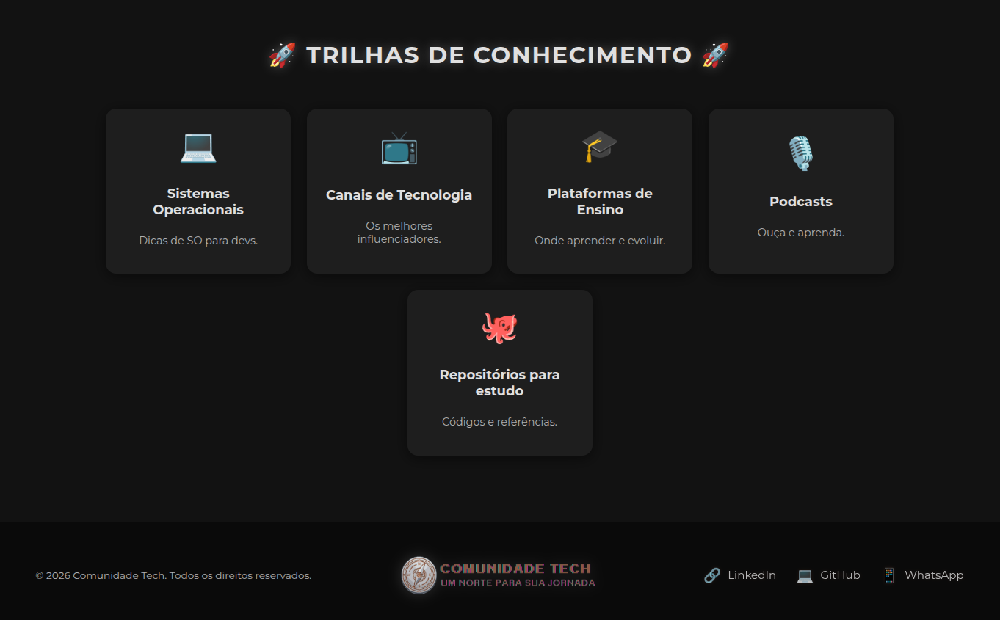

<h1 align="center">🚀 Comunidade Tech - Um norte para sua jornada 🚀</h1>

<p align="center">
  
</p>

<p align="center">
  
  
  
  
  
</p>

---

<h1 align="center">🌟 Sobre o Projeto</h1>

O **Comunidade Tech** é uma Single Page Application (SPA) moderna criada para centralizar recursos essenciais de tecnologia. Com foco em experiência do usuário e visual premium, a plataforma funciona como um guia prático para estudantes e profissionais da área.

A aplicação utiliza uma estética **Glassmorphism** com efeitos de **Neon Sepia**, proporcionando uma interface vibrante e tecnológica que se destaca visualmente.

<h1 align="center">✨ Funcionalidades</h1>

- 🖥️ **Sistemas Operacionais:** Dicas e recomendações de SO para desenvolvedores.
- 📺 **Canais de Tecnologia:** Curadoria dos melhores influenciadores e educadores do YouTube.
- 🎓 **Plataformas de Ensino:** Guia de onde aprender as tecnologias mais requisitadas.
- 🎙️ **Podcasts:** Conteúdo em áudio para aprender em qualquer lugar.
- 🐙 **Repositórios de Estudo:** Links diretos para os melhores projetos open-source e roteiros de estudo.
- ⚡ **Navegação Ultra-Rápida:** Transições otimizadas e sistema de carregamento fluido.
- ☁️ **Integração com Firebase:** Persistência de dados em tempo real via Firestore e hospedagem escalável via Firebase Hosting.

<h1 align="center">📸 Interface Progressiva</h1>

<p align="center">
  
  <br>
  <i>Dashboard Principal com design responsivo e efeitos neon.</i>
</p>

<h1 align="center">🛠️ Tecnologias Utilizadas</h1>

- **Framework:** [Angular](https://angular.io/) (v21+)
- **Backend/Database:** [Firebase Firestore](https://firebase.google.com/products/firestore)
- **Hospedagem:** [Firebase Hosting](https://firebase.google.com/products/hosting)
- **Estilização:** CSS3 Avançado (Variables, Grid, Flexbox, Animations)
- **Linguagem:** TypeScript

<h1 align="center">🚀 Como Executar o Projeto</h1>

1. **Clone o repositório:**
   ```bash
   git clone https://github.com/Loljr1987/comunidade-tech.git
   ```

2. **Instale as dependências:**
   ```bash
   npm install
   ```

3. **Inicie o servidor de desenvolvimento:**
   ```bash
   npm start
   ```
   Acesse `http://localhost:4200/` no seu navegador.

<h1 align="center">📦 Deploy e Produção</h1>

Para gerar uma versão de produção e realizar o deploy no Firebase:

```bash
# Gera o build e faz o deploy simultaneamente
npm run build && npx firebase deploy --only hosting
```

<h1 align="center">👨‍💻 Autor</h1>

<p align="center">
  <strong>Lucivaldo Junior</strong><br>
  Desenvolvedor focado em criar experiências digitais modernas e impactantes.
</p>

<p align="center">
  <a href="https://www.linkedin.com/in/lucivaldojr/" target="_blank">
    
  </a>
  <a href="https://github.com/Loljr1987" target="_blank">
    
  </a>
  <a href="https://wa.me/5591981845112" target="_blank">
    
  </a>
</p>

---
<p align="center">Desenvolvido com ❤️ para a Comunidade Tech.</p>
